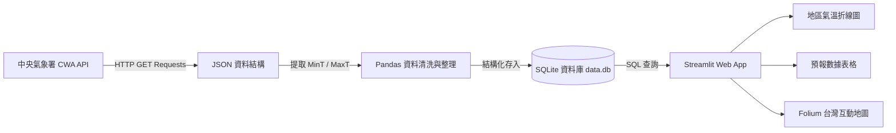

# 🌤️ Taiwan Weather Forecast — 台灣互動式天氣預報應用

> **從氣象資料到互動式天氣預報應用**  
> *用程式探索天氣 · 用資料看見台灣 · 用 AI 實現更多可能*  
> *Code Smarter, Build a Better Tomorrow!*

[](https://www.python.org/)
[](https://streamlit.io/)
[](https://www.sqlite.org/)
[](https://opendata.cwa.gov.tw/)
[](LICENSE)

**🔗 線上展示 (Live Demo)：<https://aiot-hw1-cwa-xybjhrhdrcpj7gjg7yqbtr.streamlit.app/>**

> 若開啟時顯示 "This app has gone to sleep"，點一下 **Yes, get this app back up!** 稍候約 30 秒即可喚醒（Streamlit Community Cloud 免費方案會讓閒置的應用休眠）。

---

## 📖 專案簡介 (Overview)

本專案為 **AIoT 創新微課程實作作業 (AIot-HW1-CWA)**，透過 Python 串接**交通部中央氣象署 (CWA) 開放資料平台 API**，解析各縣市天氣預報 JSON 資料，利用 **Pandas** 整理數據後存入 **SQLite** 資料庫，並運用 **Streamlit** 與 **Folium** 打造現代化的互動式氣象儀表板（Weather Dashboard）。

---

## 🛠️ 技術棧 (Tech Stack)

| 類別 | 工具 / 套件 | 說明 |
| :--- | :--- | :--- |
| **程式語言** | `Python 3.9+` | 核心開發語言 |
| **資料來源** | `CWA API` | 中央氣象署氣象資料開放平臺 RESTful API |
| **網路請求** | `Requests` | 取得 API JSON 資料 |
| **資料處理** | `Pandas` | 資料清洗、型態轉換與結構化整理 |
| **資料儲存** | `SQLite3` | 輕量化本地關聯式資料庫 (`data.db`) |
| **前端應用** | `Streamlit` | 快速建立互動式 Web Dashboard |
| **地圖視覺化** | `Folium` / `streamlit-folium` | 台灣地理空間資訊與溫度階層標註 |
| **圖表繪製** | `Altair` / `Plotly` / `Matplotlib` | 一週最高溫與最低溫折線圖 |

---

## 📐 系統架構與資料流程 (Architecture)



---

## 🗄️ 資料庫設計 (Database Schema)

資料庫檔案採用 SQLite：`data.db`，核心資料表為 `TemperatureForecasts`：

```sql
CREATE TABLE IF NOT EXISTS TemperatureForecasts (
    id INTEGER PRIMARY KEY AUTOINCREMENT,
    regionName TEXT NOT NULL,       -- 地區 / 縣市名稱 (例: 北部地區、中部地區)
    dataDate TEXT NOT NULL,         -- 預報日期 (YYYY-MM-DD)
    minT REAL,                      -- 最低氣溫 (°C)
    maxT REAL,                      -- 最高氣溫 (°C)
    created_at TIMESTAMP DEFAULT CURRENT_TIMESTAMP,
    UNIQUE(regionName, dataDate)    -- 避免重複執行時重複插入
);
```

### 常用驗證 SQL 語法：
```sql
-- 查詢所有地區名稱
SELECT DISTINCT regionName FROM TemperatureForecasts;

-- 查詢特定地區一週氣溫
SELECT dataDate, minT, maxT 
FROM TemperatureForecasts 
WHERE regionName = '中部地區' 
ORDER BY dataDate ASC;
```

---

## ✨ 核心功能特點 (Key Features)

1. **自動化 API 串接**：支援 CWA API Key 認證，定時或按需抓取最新天氣預報資料。
2. **健壯的資料處理**：防呆機制解析多層巢狀 JSON，自動轉換日期與浮點數溫標。
3. **資料庫防重複寫入**：利用 SQLite 複合唯一鍵 (`regionName`, `dataDate`)，重複更新時自動覆蓋或略過。
4. **互動式前端控制**：
   - 區域下拉式選單即時切換。
   - 最高溫 ($MaxT$) 與最低溫 ($MinT$) 趨勢折線圖對比。
   - 結構化一週預報資料表展示。
5. **進階地理視覺化**：
   - 使用 **Folium** 渲染台灣各分區/縣市地圖。
   - 溫度區間色階標籤（`< 20°C`, `20 - 25°C`, `25 - 30°C`, `> 30°C`）。
   - 日期切換動態觀看全台氣溫分佈。

---

## 📂 專案目錄結構 (Project Structure)

```text
AIot-HW1-CWA/
├── .gitignore
├── README.md               # 專案說明文件
├── requirements.txt        # Python 依賴套件清單
├── config.py               # 設定檔 (API Key、資料庫路徑等)
├── fetch_cwa.py            # CWA API 抓取與資料入庫腳本
├── database.py             # SQLite 資料庫初始化與 CRUD 模組
├── app.py                  # Streamlit 主程式介面
└── data/
    └── data.db             # SQLite 資料庫檔案
```

---

## 🚀 快速開始 (Getting Started)

### 1. 取得專案並安裝依賴套件

```bash
# 複製儲存庫 (若尚未 clone)
git clone https://github.com/BlueET1/AIot-HW1-CWA.git
cd AIot-HW1-CWA

# 建立並啟用虛擬環境 (建議)
python -m venv venv
# Windows:
.\venv\Scripts\activate
# macOS/Linux:
source venv/bin/activate

# 安裝必要套件
pip install -r requirements.txt
```

### 2. 設定 CWA API Key
前往 [中央氣象署氣象資料開放平臺](https://opendata.cwa.gov.tw/) 註冊並取得授權碼（API Key）。  
建立或設定 `.env` 或 `config.py`：
```python
CWA_API_KEY = "YOUR_CWA_API_KEY_HERE"
```

### 3. 執行資料擷取與寫入資料庫

```bash
python fetch_cwa.py
```

### 4. 啟動 Streamlit 視覺化儀表板

```bash
streamlit run app.py
```
啟動完成後，瀏覽器將自動開啟 `http://localhost:8501`。

---

## 🗺️ 學習地圖 (24 個模組實作步驟)

依據課程架構規劃之 24 個關鍵學習里程碑：

- [x] **01. 課程介紹** — AI × 資料 × 天氣 × 實作
- [x] **02. 台灣的天氣與生活** — 氣象的重要性與生活決策
- [x] **03. 中央氣象署 CWA 平台** — 註冊帳號、取得 API Key
- [x] **04. API 資料取得** — 使用 Requests 抓取 JSON
- [x] **05. JSON 資料結構解析** — 尋找氣溫資料與層層定位
- [x] **06. 提取最高與最低氣溫** — MinT / MaxT 分析與結構化
- [x] **07. 資料整理與預覽** — 使用 Pandas 觀察與前處理
- [x] **08. 建立 SQLite 資料庫** — `data.db` 建立與資料表操作
- [x] **09. 資料庫設計** — `TemperatureForecasts` 綱要設計
- [x] **10. 查詢資料驗證** — 使用 SQL 語句驗證資料正確性
- [x] **11. Streamlit 入門** — 快速架設 Python Web App
- [x] **12. 從資料庫讀取資料** — 使用 SQL 與 Pandas 串聯前端
- [x] **13. 下拉選單選擇地區** — 互動元件開發
- [x] **14. 繪製折線圖** — 一週最高最低溫視覺化
- [x] **15. 顯示資料表格** — 明確呈現每週氣溫數據
- [x] **16. 整合 Web App 介面** — 選地區看預報之完整 UI
- [x] **17. 進階：台灣地圖視覺化** — Folium + Streamlit 結合
- [x] **18. 選擇日期顯示地圖** — 互動式日期切換地圖
- [x] **19. 完整成果展示** — Taiwan Weather Dashboard 整合
- [x] **20. 程式碼品質與優化** — 結構清晰、防重複插入、例外處理
- [x] **21. 專案上傳至 GitHub** — Git 版本控制、Commit & Push
- [x] **22. 延伸應用與想法** — Line Bot、旅遊/農業/防災應用
- [x] **23. 回顧與重點整理** — 掌握從資料到 AI 應用的端到端技能
- [x] **24. 下一步：繼續探索** — 串接更多公開資料與 AI 模型

---

## 💡 未來延伸 (Future Work & Extensions)

- [x] **台灣即時氣象地圖**：以本專案為基礎的延伸作品，改用 CWA 即時觀測資料（363 個測站）搭配 MapLibre GL 深色地圖與風場粒子動畫。
  原始碼：[BlueET1/AIot-HW1-CWA-web](https://github.com/BlueET1/AIot-HW1-CWA-web) ｜ 線上展示：<https://a-iot-hw-1-cwa.vercel.app/>
- [ ] **天氣提醒 Line Bot**：結合 Line Messaging API，每日自動推播降雨與溫度提醒。
- [ ] **旅遊推薦應用**：依照各地即時預報給予旅遊穿搭與出行建議。
- [ ] **智慧農業 / 防災警訊**：低溫寒害或強降雨預警模型。
- [ ] **結合 LLM (AI 分析)**：使用 Gemini API 自動生成口語化的當日氣象主播評論。

---

> 💡 *「技術可以解決問題，但更重要的是用技術創造更好的未來！」—— 煥哥*
